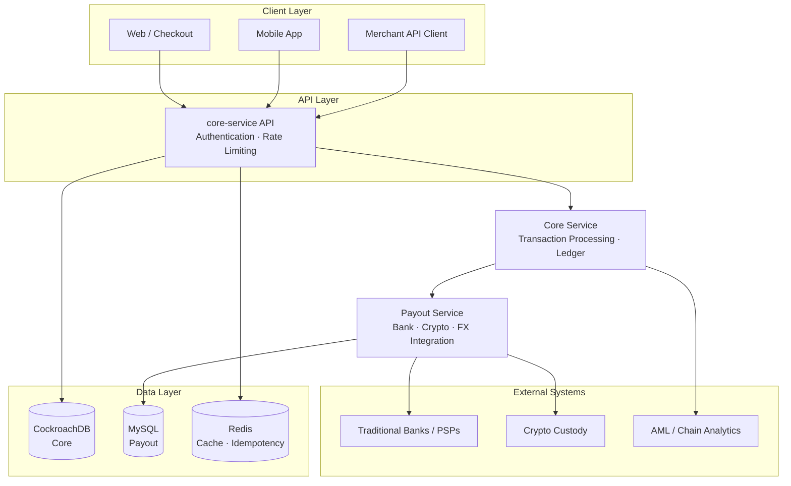
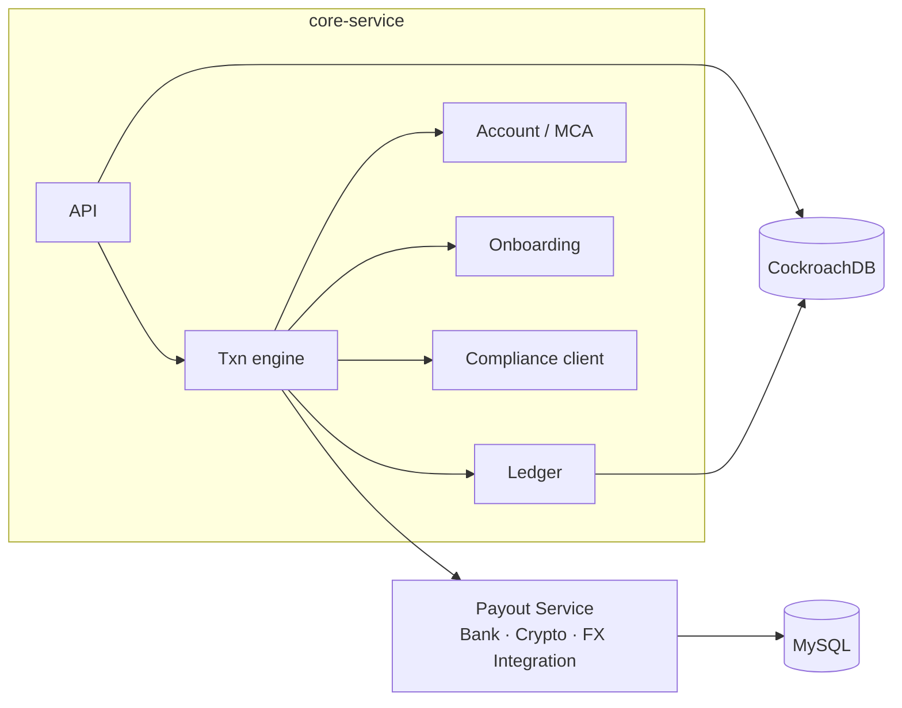

<div align="center">
  
  # Hi, I'm Tony 👋
  
  **Engineering Leader · Payment Architect · Crypto Platform**  
  Singapore 🇸🇬 · Ex-YouTrip · Ex-Aspire · Ex-Thunes
  
  [](https://www.linkedin.com/in/tony007/)
  [](https://github.com/Aibier)
  [](mailto:tony.aizize@you.co)
  [](https://github.com/Aibier)
  
  <br/>
  
  **Senior Engineering Manager, Crypto Platform & Infrastructure** at [Triple A](https://triple-a.io)
  
  *10+ years building ledgers, multi-currency wallets, cross-border payouts, and crypto payment rails at scale.*
  
</div>

---

## 🔭 About me

- 🏗️ Architect **payment platforms** end-to-end: **ledger**, **MCA**, **FX**, **card**, **payout**, **on/off-ramp**
- 🪙 Build **stablecoin & crypto** infrastructure alongside **fiat** rails
- 🏦 Shipped integrations with **50+ banks & payment providers** (APAC · EMEA · US)
- 👥 Led **20+ engineers** (YouTrip); career ladders, delivery, and platform strategy
- 🌏 Multi-market systems (SG · HK · AU) with expansion and compliance in mind

```text
Focus:  payments · crypto · distributed systems · engineering leadership
Open:   connecting with fintech builders & payment platform peers
```

---

## 📌 Snapshot

<div align="center">

| | |
|:--:|:--:|
| **10+** years payments | **50+** bank / PSP integrations |
| **20+** engineers led | **SG · HK · AU** multi-market platforms |
| Go · Kafka · CRDB · AWS | Ledger · MCA · Crypto · FX · Card |

<sub>Most production work lives in private fintech repos — public contribution counters understate day-to-day shipping.</sub>

</div>

---

## 🛠️ Tech stack

**Languages**


**Data & messaging**


**Cloud & platform**


**Observability**


**Domain**

`Ledger` · `Double-entry` · `FX` · `Card issuing` · `Payouts` · `Webhooks` · `AML` · `Reconciliation` · `PCI-DSS`

---

## 💼 Experience

| | Role | Focus |
|:--|:--|:--|
| **[Triple A](https://triple-a.io)** 🇸🇬 | Senior EM · Crypto Platform & Infra | Stablecoin / crypto payment platform & infrastructure |
| **YouTrip** 🇸🇬 | Engineering leadership · MCA / YouBiz | Multi-currency wallets & cards · Family Card · 3DS · career ladder · **20+** engineers |
| **Aspire** 🇸🇬 | Payment architecture | MCA · VA · payout · FX · multi-market **SG / HK / AU** |
| **Thunes** 🌐 | Tech lead · integrations | GrabPay · TikTok pay · **2M+** daily tx · Alipay · DBS · RippleNet · MoneyGram · **15+** partners |

---

## 🏆 Featured work

<table>
<tr>
<td width="50%" valign="top">

### Payout Service
Multi-currency global payouts microservice.  
**Providers:** JPM · DBS · Wise · HDFC · PayPal · Stripe · RippleNet · **40+** others.  
Event-driven processing, high throughput, bank-grade reliability.

</td>
<td width="50%" valign="top">

### Acceptance / Webhooks
Real-time payment acceptance with **100%** ack path to providers.  
Fraud workflows aligned with **MAS** / **HKMA**.  
AWS · Kafka · Redis · Datadog at scale.

</td>
</tr>
<tr>
<td width="50%" valign="top">

### Grab & TikTok Pay (Thunes)
Tech lead for high-volume APAC corridors.  
**2M+** daily transactions · custom routing & settlement.  
~**50%** faster integration timelines.

</td>
<td width="50%" valign="top">

### Cross-border & Core Banking
Unified FX + payout platforms (**$50M+** / mo class systems).  
HA account management & reconciliation modules.  
**Taymas-Bank** samples — open source planned **2026**.

</td>
</tr>
</table>

---

## 🏦 Integrations (sample)

**Networks & wallets**  
Alipay · WeChat Pay · PayPal · Stripe · MoneyGram · RippleNet · GrabPay

**FX & cross-border**  
Wise · CurrencyCloud · Thunes

**Banks**  
J.P. Morgan · DBS · Citi · Standard Chartered · HDFC · SeaBank · CZBank · Maybank · KBank · SCB · 9Pay · Bank Alfalah · …

---

## 🏗️ Payment architecture

### Platform shape



### Core service internals



### On-ramp & off-ramp

| | On-ramp (collection) | Off-ramp (payout) |
|---|---|---|
| API | `POST /v1/payments` | `POST /v1/payouts` → confirm |
| Ledger | Pending credit → post after AML + finality | Debit hold first → post / void |
| AML | Async hold | Sync, fail-closed |
| Rails | Deposit / VA via payout-service | Dispatch via payout-service |
| Assets | Fiat **and** crypto MCA | Fiat **and** crypto destinations |

---

## 🎓 Education

| Year | Credential |
|:--|:--|
| 2025 | Management Essentials — **Harvard Business School** |
| 2021 | M.Tech Software Engineering — **NUS** 🇸🇬 (big data · scalable systems) |
| 2015 | M.Comp Computer Science — **NUS** 🇸🇬 |
| 2011 | B.S. Management Science & Engineering — **CUFE** 🇨🇳 |

---

## 📄 Resources

- 📋 [Resume / CV](https://github.com/Aibier/Aibier/blob/main/resume.pdf)
- 📖 [Technical portfolio](https://github.com/Aibier/Aibier/blob/main/portfolio.pdf)
- 🏦 [Bank integration guide](https://drive.google.com/file/d/19g5SY3wFXJeZKx0nm6leUdoQecCtkABr/view?usp=sharing)

---

<div align="center">
  
  ### Let's build resilient payment platforms 🤝
  
  [LinkedIn](https://www.linkedin.com/in/tony007/) · [Email](mailto:tony.aizize@you.co) · [GitHub](https://github.com/Aibier)
  
  <sub>Always open to chat with fintech engineers, payment architects, and platform leaders.</sub>
  
</div>
