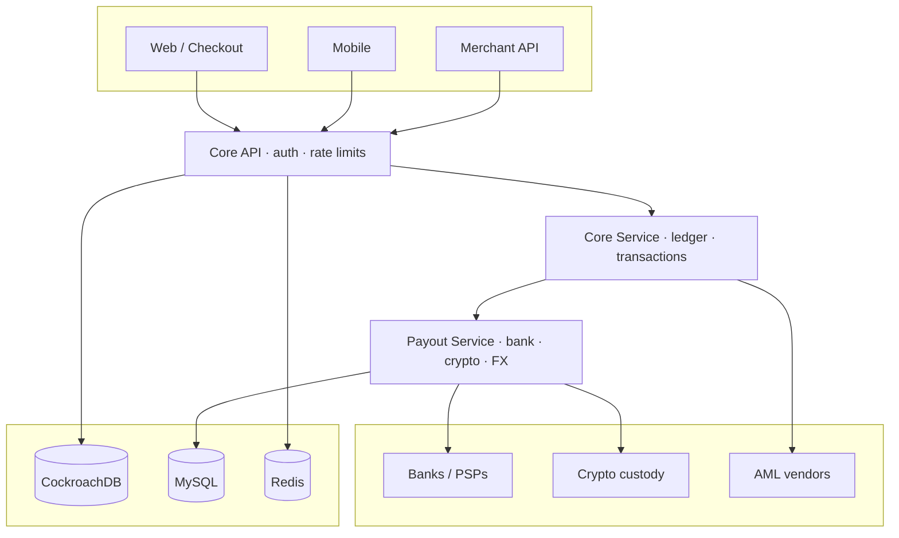

# Tony

### Payment Architect · Engineering Leader · Crypto Platform

**Senior Engineering Manager** · Crypto Platform & Infrastructure · [Triple A](https://triple-a.io) 🇸🇬

*Ex-YouTrip · Ex-Aspire · Ex-Thunes · 10+ years shipping money systems*

 

 

 

I design and lead **payment platforms** that move money safely at scale: **ledgers**, multi-currency accounts, **FX**, card rails, **payouts**, and **crypto / stablecoin** infrastructure.

Most of my career has been inside regulated fintech: building systems that banks, PSPs, and merchants depend on every day, and leading the teams that keep them reliable.

### GitHub activity

---

### What I work on

Ledger design · multi-currency wallets · cross-border payouts · card issuing · on-ramp / off-ramp · webhooks · reconciliation · AML-aware flows · multi-region expansion

---

### Where I've been

**[Triple A](https://triple-a.io)**: leading crypto platform and infrastructure engineering for stablecoin payment rails.

**YouTrip**: led 20+ engineers across MCA and YouBiz; Family Card, 3DS, top-ups, business accounts; multi-currency wallets and cards processing at large scale; engineering career ladder.

**Aspire**: payment architecture for multi-currency business accounts across Singapore, Hong Kong, and Australia; virtual accounts, payout, and FX provider integrations.

**Thunes**: tech lead for GrabPay and TikTok influencer pay; high-volume APAC corridors; 15+ partners including Alipay, DBS, RippleNet, and MoneyGram.

---

### Selected work

**Payout service** 
Multi-currency global payouts with 40+ providers (JPM, DBS, Wise, HDFC, PayPal, Stripe, RippleNet, and more). Event-driven, high throughput, bank-facing reliability.

**Payment acceptance & webhooks** 
Real-time provider acknowledgement path, fraud workflows under MAS / HKMA expectations, horizontal scale on AWS, Kafka, Redis, and Datadog.

**High-volume processors** 
Grab and TikTok payment integrations supporting millions of daily transactions, with routing and settlement logic tuned for regional rails.

**Cross-border platforms** 
Unified FX and payout services, plus core account and reconciliation modules for high-availability money systems.

---

### Stack I use most

---

### Architecture I care about

Core owns money truth. Rails stay in a payout service. Fiat and crypto share one account and ledger model. One codebase, multi-region ready: expand markets by configuration, not by forking the platform.

---

### Integrations

**Banks**  
J.P. Morgan · DBS · OCBC · Standard Chartered · Citi · HDFC · SeaBank · Maybank · KBank · Siam Commercial Bank · CZBank · Bank Alfalah · 9Pay · and other regional banks across APAC, EMEA, and the US

**Mobile wallets & payment networks**  
Alipay · WeChat Pay · GrabPay · PayPal · Stripe · MoneyGram · RippleNet

**FX & cross-border**  
Wise · CurrencyCloud · Thunes

**Custody & crypto infrastructure**  
Fireblocks · BitGo · Copper · Circle · Coinbase Prime · QuickNode

---

### Education

- **Harvard Business School**: United States · Management Essentials (2025)
- **National University of Singapore**: Singapore · M.Tech Software Engineering (2021)
- **National University of Singapore**: Singapore · M.Comp Computer Science (2015)
- **Central University of Finance & Economics**: China · B.S. Management Science & Engineering (2011)

---

### Resources

[Resume](https://github.com/Aibier/Aibier/blob/main/resume.pdf)
&nbsp;·&nbsp;
[Portfolio](https://github.com/Aibier/Aibier/blob/main/portfolio.pdf)
&nbsp;·&nbsp;
[Bank integration guide](https://drive.google.com/file/d/19g5SY3wFXJeZKx0nm6leUdoQecCtkABr/view?usp=sharing)

 

Always happy to connect with people building serious payment systems.

[LinkedIn](https://www.linkedin.com/in/tony007/) · [Email](mailto:tony.aizize@you.co) · [GitHub](https://github.com/Aibier)

