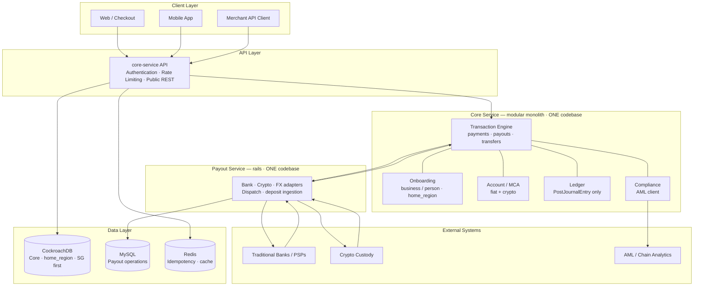

## 👋 Hi there! I'm Tony (aka Aibier)

Engineering Leader & hands-on Payment Architect with **10+ years** building mission-critical payment platforms at high-growth fintechs.

Currently **Senior Engineering Manager, Crypto Platform & Infrastructure** at **[Triple A](https://triple-a.io)** 🇸🇬, leading engineering teams building crypto payment infrastructure and platforms.

---

### 🔹 What I Do

✅ Architect and scale payment infrastructure (card issuing 💳, FX 💱, cross-border payments 🌏, ledger design 📒)  
✅ Build stablecoin and crypto payout infrastructure 🪙, enabling programmable money movement across fiat and crypto rails  
✅ Lead engineering teams delivering multi-currency wallets, crypto platforms, and business account platforms  
✅ Design microservices architectures enabling seamless market expansion  
✅ Manage all major payment integrations and third-party technical communications with **50+ banks and payment providers** globally 🏦  

### 🔹 Track Record

✅ 🇸🇬 **Triple A**: Head of Crypto/Stablecoin Platform & Infrastructure, leading engineering teams building crypto payment infrastructure and platforms.  
✅ 🇸🇬 **YouTrip**: Led 20+ engineers across MCA and YouBiz; launched Family Card, owned core card capabilities (3DS, top-ups, business accounts), designed the Engineering Career Ladder, and delivered multi-currency wallets and card platforms processing Billions of Dollars annually.  
✅ 🇸🇬 **Aspire**: Architected payment infrastructure (building multi-currency business accounts) across Singapore 🇸🇬, Hong Kong 🇭🇰, and Australia 🇦🇺; designed microservices-based payment service architecture integrating with business virtual account, payout and FX providers.  
✅ 🌐 **Thunes**: Integrated 15+ payment partners including Alipay, DBS, Grab, RippleNet, MoneyGram.  

### 🔹 Architecture Expertise

💳 Card Issuing | 💱 FX/Cross-border | 📒 Ledger Design | ⚙️ Microservices | 🔌 API Design | 🗄️ Distributed Systems

### 🔹 Tech Stack

🐹 **Golang** | Python | Java | Kafka | PostgreSQL | Redis | Docker | AWS | ☸️ Kubernetes

---

## 🛠️ Technical Skills

**Languages & Frameworks:**
- 💻 **Backend**: Go, Java, Python, Perl, Node.js, Typescript
- 🗄️ **Databases**: PostgreSQL, Redis, MongoDB, DynamoDB, CockroachDB
- 📨 **Message Queues**: Apache Kafka, RabbitMQ, AWS SQS
- ☁️ **Cloud & DevOps**: AWS Cloud (ECS, Lambda, RDS, CloudWatch), Docker, Kubernetes
- 📊 **Monitoring**: Datadog, Prometheus, Grafana
- 🔒 **Payment Systems**: PCI DSS compliance, fraud detection, reconciliation

**Architecture Patterns:**
- ⚙️ Microservices architecture
- 📡 Event-driven systems
- 🔄 CQRS and Event Sourcing
- 🏛️ High-availability distributed systems
- ⚡ Real-time payment processing

**Leadership & Management:**
- 👥 Engineering team leadership (20+ engineers)
- 🗺️ Technical roadmap planning and execution
- 🤝 Cross-functional collaboration and stakeholder management
- 🔁 Agile/Scrum methodologies and sprint planning
- 📈 Performance management and career development
- 🏗️ Technical decision-making and architecture reviews

---

## 🚀 Impactful Projects & Bank Integrations  

Over the last **9 years**, I've successfully integrated with **50+ banks and payment providers** across APAC, EMEA, and the US, enabling multi‑currency, real‑time, and cross‑border money movement.  

**Key Integrations:**  
- 🌐 **Global Payment Networks**: Alipay, WeChat Pay, PayPal, Stripe, MoneyGram, RippleNet  
- 💱 **FX & Cross‑Border Providers**: Wise, CurrencyCloud, Thunes  
- 🏦 **Major Banks**: J.P. Morgan, DBS Bank 🇸🇬🇭🇰, Citibank, Standard Chartered, CZBank 🇨🇳, HDFC Bank 🇮🇳, SeaBank 🇸🇬, 9Pay 🇻🇳, Bank Alfalah, Siam Commercial bank, KBank, MayBank (MY)
- 🏧 **Others**: Regional clearing systems and direct debit platforms  

**Highlight Projects:**  
- 🌍 **Cross‑Border Payment Platform** → Unified FX and payout microservices handling $1B+ monthly volume  
- 🏦 **Core Banking System** → Architected high‑availability modules for account management & reconciliation  
- 🔓 **Taymas‑Bank** → *(Planned open‑source release by end of 2026, contains all major bank integration samples, stay tuned 👀)*  

---

## 🏆 Highlight Projects  

- 💸 **Payout Service (Payment Integration Microservice)**  
  - **Led engineering team** to design and build a system handling **multi‑currency global payouts** with high throughput and reliability.  
  - **Managed integration projects** with **JPM 🇺🇸, DBS 🇸🇬, Wise, HDFC 🇮🇳, PayPal, Stripe, RippleNet 🔵, and 40+ other providers**.  
  - **Architected event‑driven flows** via Kafka for near real‑time processing, ensuring team alignment on technical decisions.  

- 🔔 **Acceptance Service (Payment Webhook Service)**  
  - **Led cross-functional team** to architect a **real‑time payment acceptance platform** handling webhook‑driven transaction updates for merchants across multiple regions.  
  - **Managed SLA commitments** ensuring **real‑time 100% availability and acknowledgement to providers**.  
  - **Coordinated compliance initiatives** integrating **fraud detection workflows** in alignment with **MAS** 🇸🇬 and **HKMA** 🇭🇰 regulatory standards.  
  - **Directed technical architecture** for **horizontal scalability** and **high availability** using AWS ☁️, Kafka 📨, and Redis, ensuring resilience during traffic spikes.  
  - **Implemented monitoring strategies** improving transaction success rates and lowering fraud risk through **event‑driven monitoring and alerting** with Datadog 📊.  

- 🟢 **Grab and TikTok Payment Processor (Thunes)**  
  - **Led technical team** as **Tech Lead** overseeing the integration of **GrabPay** and **TikTok Influencer Pay** 🎵 into Thunes' global cross‑border payment platform.  
  - **Managed high-volume operations** supporting **2M+ daily transactions** ⚡, ensuring low‑latency processing and high availability across APAC markets.  
  - **Directed engineering efforts** for custom API bridges and routing logic to handle **regional settlement and compliance requirements**, reducing integration timelines by **50%**.  
  - **Delivered business impact** enabling merchants to process **millions of transactions monthly** with reduced latency and improved reliability.  

- 🌍 **Cross‑Border Payment Platform**  
  - Unified FX 💱 and payout microservices, handling **$50M+ monthly volume**.  

- 🏦 **Core Banking System**  
  - **Managed architecture design** for high‑availability modules handling **account management and reconciliation**.  

- 🔓 **Taymas‑Bank** *(Open‑sourcing planned by end of 2026, stay tuned 👀)*  

---

## 🏗️ Payment Architecture (current)

> **Source of truth for this diagram:** single-codebase modular Core + Payout rails · multi-region by design (Singapore first) · on-ramp **and** off-ramp on one engine.  
> Not the old multi-service sketch (no DynamoDB-as-payout-store, no required API Gateway / separate AML service at launch).

### Platform shape

*Layered view (same style as classic payment architecture diagrams): clients → API → Core → rails → external systems + data.*

### On-ramp + off-ramp (same Core)

| | **On-ramp (collection)** | **Off-ramp (payout)** |
|---|---|---|
| API | `POST /v1/payments` | `POST /v1/payouts` → confirm |
| Ledger | Pending credit → post after AML + finality | Debit hold first → post/void |
| AML | Async hold | Sync fail-closed |
| Rails | Deposit / VA via payout-service | Dispatch via payout-service |
| Assets | Fiat **and** crypto MCA | Fiat **and** crypto destinations |

Internal **transfers** are ledger-only (no rails). One ledger, one MCA model, one `home_region` tree.

### Non-negotiables baked into this architecture

- **Single source code** — expand US/EU by config + capacity, not regional forks  
- **Multi-region ready** from day one (`home_region`); **launch Singapore**  
- **Core owns money truth** (CockroachDB); Payout Service never holds customer balances  
- **Modular monolith** for Account / Onboarding / compliance client at launch; extract on trigger  

---
## 🎓 Background & Education

I'm passionate about building developer-friendly, resilient payment platforms and driving engineering excellence. I thrive at the intersection of strategy, architecture, and execution, turning complex payments challenges into scalable solutions.

Always open to connecting with fellow fintech builders and payment enthusiasts 🤝

- 📫 **Reach Me**: [LinkedIn](https://www.linkedin.com/in/tony007/)  
- 🎓 **Education**:
  - 🏫 Management Essentials by Harvard Business School (2025)
  - 🎓 Master of Technology in Software Engineering (including big data engineering and scalable system design), National University of Singapore (2021) 🇸🇬
  - 🎓 Master's in Computer Science, National University of Singapore (2015) 🇸🇬
  - 🎓 Bachelor's in Management Science and Engineering, Central University of Finance & Economics (2011), Beijing 🇨🇳

---

## 💡 Looking For  

I'm looking to connect with professionals who have **solid expertise in building payment platforms (microservices)** 🏗️ and share a passion for **scalable, resilient architectures** 🚀.  

---

## 📬 Let's Connect

  
  
  

  

---

## 📄 Documents & Resources

- 📋 **[Resume/CV](https://github.com/Aibier/Aibier/blob/main/resume.pdf)** - Download my latest resume
- 📖 **[Technical Portfolio](https://github.com/Aibier/Aibier/blob/main/portfolio.pdf)** - Detailed technical projects and achievements
- 🏦 **[Bank Integration Guide](https://drive.google.com/file/d/19g5SY3wFXJeZKx0nm6leUdoQecCtkABr/view?usp=sharing)** - Comprehensive guide to payment system integrations

---

  

